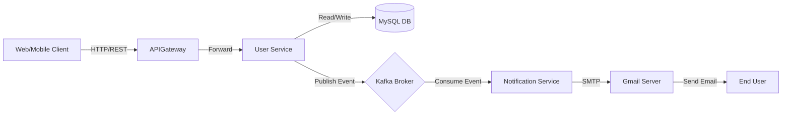

# Technical Functional Document (TFD) - User Service
**Project:** Stealz E-Commerce  
**Module:** User Management Microservice  
**Architect:** Neel There  
**Date:** 2026-01-23

---

## 1. Introduction
### 1.1 Purpose
The User Service is the central authority for managing customer identities, security, and profiles within the Stealz E-Commerce platform. It handles user onboarding, authentication, and synchronization of user data across the ecosystem using an event-driven architecture.

### 1.2 Scope
- User Registration & Validation
- Role-Based Access Control (RBAC)
- Profile Management
- Asynchronous Notification Triggers (Email Verification)

---

## 2. Functional Requirements
### 2.1 User Registration
- **Input:** Username, Email, Password, Full Name, Phone Number, Role.
- **Validation:** 
  - Email must be unique.
  - Password must be encrypted.
  - Role must be one of: `CUSTOMER`, `MERCHANT`, `ADMIN`.
- **Process:**
  1. Validate input format and uniqueness.
  2. Persist user to MySQL with `isVerified = false`.
  3. Generate a UUID verification token.
  4. Publish `emailVerificationTopic` event to Kafka.

### 2.2 Email Verification
- **Input:** Verification Token (via URL link).
- **Process:**
  1. Validate token against database.
  2. Update user status to `isVerified = true`.
  3. Clear verification token.
  4. Return success HTML response.

### 2.3 User Profile Management
- **Capabilities:**
  - View user details (Protected).
  - Update non-sensitive fields (First Name, Last Name, Address, Phone).
- **Event:** Publish `user-events` (USER_UPDATED) on changes to notify other services (e.g., Order Service).

---

## 3. Technical Architecture
### 3.1 Tech Stack
- **Core Framework:** Spring Boot 3.3.2 (Java 17)
- **Database:** MySQL 8.0 (Hibernate ORM)
- **Message Broker:** Apache Kafka (Confluent/KRaft)
- **Containerization:** Docker & Docker Compose
- **Build Tool:** Maven

### 3.2 System Context


---

## 4. Data Design
### 4.1 Schema: `users` Table
| Column Name | Data Type | Constraints | Description |
|-------------|-----------|-------------|-------------|
| `id` | BIGINT | PK, Auto Inc | Unique User ID |
| `username` | VARCHAR | Not Null, Unique | User login handle |
| `email` | VARCHAR | Not Null, Unique | User email address |
| `password` | VARCHAR | Not Null | BCrypt encrypted hash |
| `role` | ENUM | Not Null | `ADMIN`, `MERCHANT`, `CUSTOMER` |
| `is_verified`| BOOLEAN | Default `false` | Email verification status |
| `verification_token` | VARCHAR | Nullable | UUID for email link |
| `phone_number` | VARCHAR | Not Null | Contact number |

---

## 5. Interface Specifications (API)
### 5.1 Registration
- **Endpoint:** `POST /api/users/register`
- **Body:**
  ```json
  {
    "username": "neel_test",
    "email": "neel@example.com",
    "password": "strongPassword",
    "fullName": "Neel There",
    "phoneNumber": "9876543210",
    "role": "CUSTOMER"
  }
  ```

### 5.2 Verification
- **Endpoint:** `GET /api/users/verify?token={uuid}`
- **Response:** HTML Page (Success/Failure)

---

## 6. Event-Driven Design (Kafka)
### 6.1 Topic: `emailVerificationTopic`
- **Producer:** User Service
- **Consumer:** Notification Service
- **Payload Format:** `email,token,username`
- **Example:** `neel@example.com,550e8400-e29b-41d4-a716-446655440000,neel_test`

### 6.2 Topic: `user-events` (Planned)
- **Events:** `USER_UPDATED`, `USER_DELETED`
- **Payload:** JSON representation of User DTO.

---

## 7. Security & Configuration
- **Password Storage:** BCrypt Hashing (Spring Security).
- **Network Security:** Docker internal network for Service-to-DB communication.
- **Environment Variables:**
  - `SPRING_DATASOURCE_URL`
  - `SPRING_KAFKA_BOOTSTRAP_SERVERS`

---
*Document automatically generated by Trae AI based on project implementation.*
